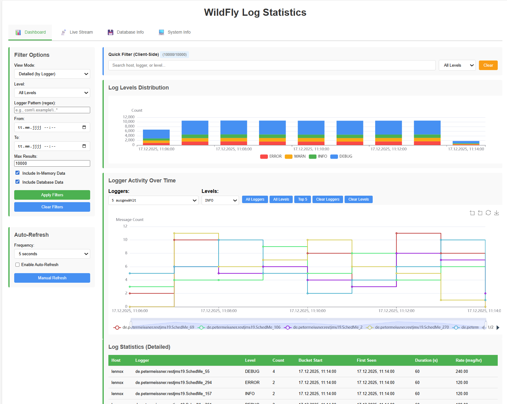
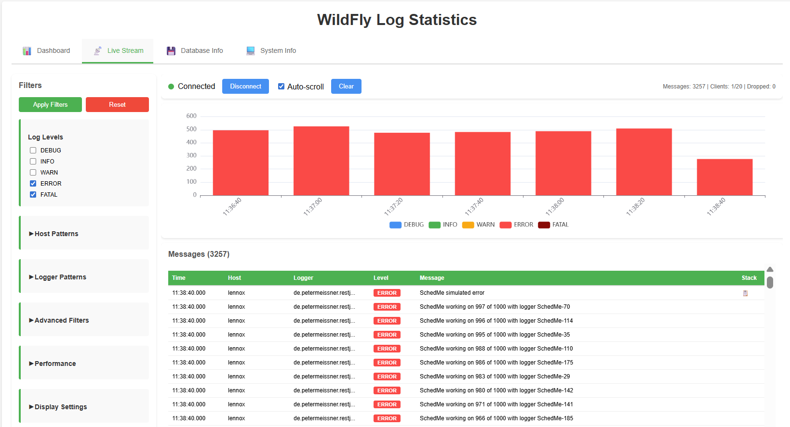
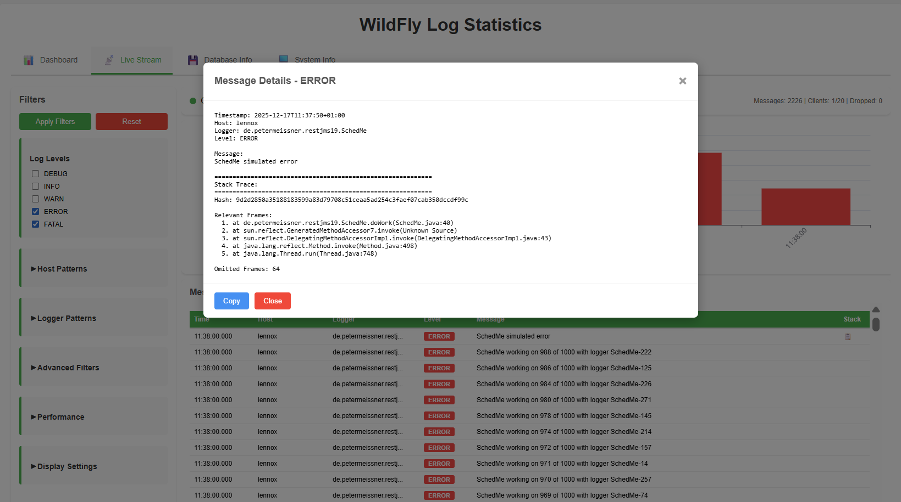
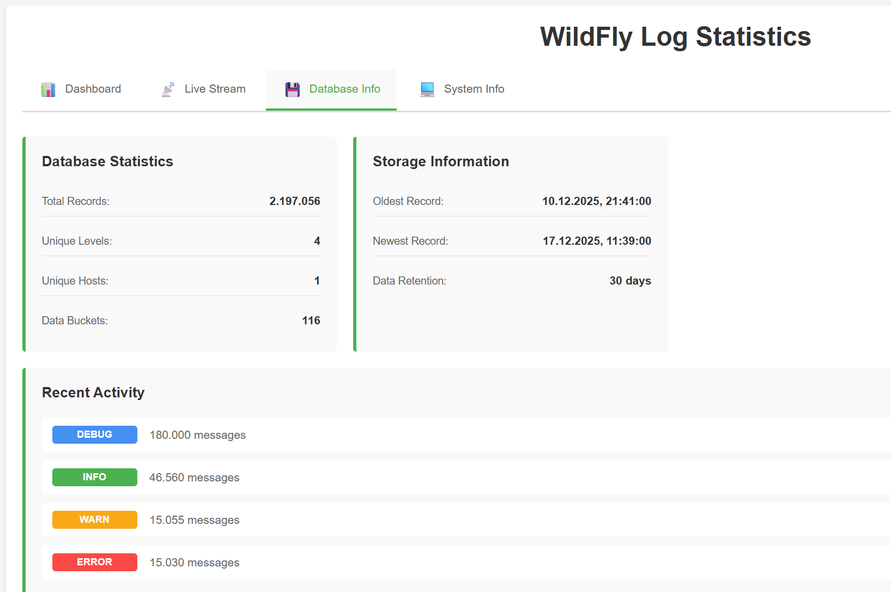

# log_stat_wf

Real-time log statistics collector and visualizer for WildFly application servers. Receives log messages via TCP, aggregates statistics in configurable time buckets, and provides a web-based dashboard with live streaming capabilities.

## Features

- **TCP Log Receiver** - Accepts JSON-formatted log messages on port 3001
- **Time-Series Aggregation** - Configurable bucket sizes (1m, 5m, 10m, 15m, 20m, 30m, 60m)
- **SQLite Storage** - Persistent storage with automatic data retention
- **Real-Time Dashboard** - Interactive charts and filtering
- **Live Message Stream** - WebSocket-based log streaming with filtering
- **Multi-Platform** - Linux, Windows, macOS (amd64/arm64)

## Quick Start

```bash
# Run with defaults (TCP :3001, HTTP :3000)
./log_stat_wf

# Custom configuration
./log_stat_wf -tcp-port 4001 -http-port 8080 -bucket-size 5m -retention-days 30
```

**Web Interface:** http://localhost:3000

## Dashboard

Interactive visualizations of log statistics with filtering and time-series analysis.



## Live Stream

Real-time log message viewing with advanced filtering, including regex patterns, level filtering, and stack trace inspection.





## Database Info

Monitor database statistics, storage information, and recent activity.



## Command Line Options

```
-host string          Host to listen on (default "localhost")
-tcp-port string      TCP port for log receiver (default "3001")
-http-port string     HTTP port for web interface (default "3000")
-db-path string       Path to SQLite database (default "log_stat.db")
-bucket-size duration Time bucket size: 1m, 5m, 10m, 15m, 20m, 30m, 60m (default 1m)
-retention-days int   Days to retain data (default 7)
-verbose              Enable verbose output
-version              Show version information
```

## Log Message Format

Send JSON log messages via TCP to port 3001:

```json
{
  "logger": "com.example.MyClass",
  "level": "INFO",
  "message": "Application started",
  "timestamp": "2025-12-17T10:30:00Z",
  "host": "server-01",
  "stacktrace": "optional stack trace"
}
```

## WildFly Integration

Configure WildFly to send logs using the included scripts:

```bash
# For log message receiver
./scripts/wildfly_config_log-message-receiver-metrics.ps1
```

## Building

```bash
./build.ps1
```

Produces binaries in `distribution/` for all supported platforms.

## Technology Stack

- **Backend:** Go, Fiber, SQLite
- **Frontend:** Vanilla JavaScript, ECharts
- **Transport:** WebSocket for real-time streaming
